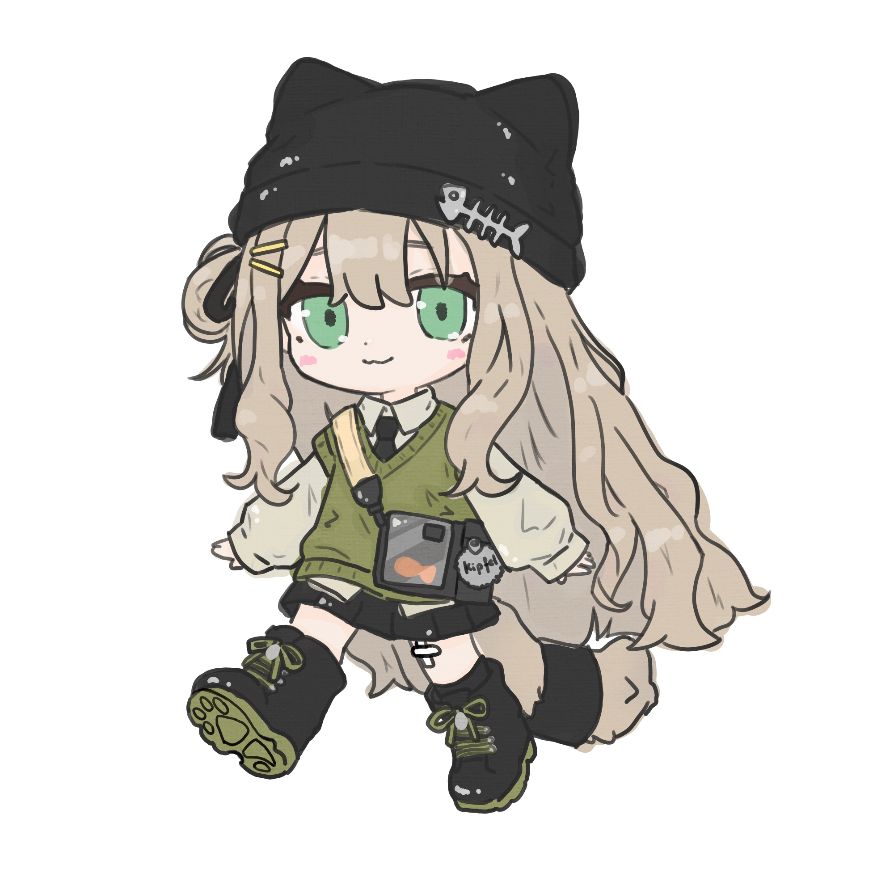

<div align="center">

# 🌸 Nyahako (ニャハコ) 🐾
### *The intelligent, ultra-fast VRChat & Unity asset sorter for BOOTH downloads.*

[](https://python.org)
[](https://microsoft.com/windows)
[](LICENSE)
[](#)
[](#)

<br/>



<p>
<b>Nya~hello!</b> Tired of your BOOTH downloads folder becoming a messy, chaotic jungle of ZIPs and <code>.unitypackage</code> files?
<br/>
<b>Nyahako</b> is a smart, super-fast desktop utility that automatically organizes your models, outfits, hairstyles, props, textures, VFX, and shaders into a clean, structured Unity library!
</p>

[✨ Features](#-features) •
[🚀 Quick Start](#-quick-start) •
[📁 Library Taxonomy](#-library-taxonomy) •
[⚙️ Standalone Build](#%EF%B8%8F-building-the-standalone-exe) •
[📜 Legal & Disclaimers](#-legal--disclaimers)

</div>

---

## ✨ Features

### 🧠 Deep In-Memory Unity Asset Inspection
Nyahako doesn't just guess based on messy filenames. It opens `.unitypackage` and `.zip` archives **directly in memory** to inspect the real asset contents:
- **Prefab Component Scanning**: Detects Unity YAML class IDs (`ParticleSystem` `--- !u!198`, `AudioSource`, `VRCAvatarDescriptor`).
- **FBX Armature & Bone Analysis**: Reads 3D model node hierarchies to distinguish **Hair** (`hair_root`, `bangs`, `twintail`) from **Clothes** (conforming armatures with `skirt`, `dress`, `sleeve`, `coat`) and full **Avatars**.
- **Pure Texture Package Detection**: Identifies face/eye textures, makeup packs, and PSDs with zero 3D meshes and routes them into `Textures_and_Art`.

### 👗 Product Family & Multi-Avatar Variant Consolidation
Creators often release 10–15 separate files for each avatar (e.g. *Tenshi to Akuma For Manuka*, *For Airi*, *MaterialGimmickPack*). 
Nyahako automatically clusters them into a single, clean product folder with organized subfolders:
```text
Clothes/
└── Tenshi_to_Akuma/
    ├── For_Airi/
    ├── For_Chocolat/
    ├── For_Lapwing/
    ├── For_Manuka/
    ├── For_Mayo/
    └── Materialgimmickpack/
```
**Family Consensus Engine**: If an outfit includes a gimmick or material addon pack, Nyahako keeps the addon grouped together with the outfit instead of scattering it into different folders.

### ⚡ Zero-Lag, Ultra-Fast Scanning (60 FPS)
- **Fast-Path Table Streaming**: Inspects archive central directory headers in **0.5 milliseconds** without decompressing unnecessary vertex buffers or textures into RAM.
- **Batched 60 FPS UI Console**: Activity logs are queued and flushed at a smooth 25ms interval, ensuring the GUI remains silky smooth on any device — even budget laptops!
- **Continuous Progress**: Dual-pass real-time progress indicator during both scanning and sorting.

### 🐱 Zero-Overhead Self-Learning Memory
- **Learns Your Avatars**: Dynamically scans your library's `Avatars/` folder in **0.6 ms** — any new avatar you add is instantly recognized as a valid clothing/hair target.
- **Remembers Preferences**: Remembers verified product classifications and manual overrides in a tiny, lightweight memory file (`< 1 KB`) with **0% CPU** and **0.0017 ms** lookup speed.
- **Dual Persistence**: Saved both in `%APPDATA%\Nyahako\memory.json` and portable within your library root (`.nyahako_memory.json`).

### 🔍 Preview Sort Mode
Want to see where files will go before committing? Click **"Preview Sort 🔍"** to run a complete non-destructive dry-run that prints exact target categories and destinations.

### 🩹 Mojibake Auto-Healing
BOOTH ZIP archives packed on Japanese Windows systems often cause broken characters on international PCs. Nyahako automatically recovers correct Shift-JIS / UTF-8 names.

### 🖼️ Thumbnail & Document Extraction
Automatically extracts package `preview.png` thumbnails and README documentation directly into the sorted folder so you always have a visual reference.

### 🗑️ Smart Download Cleanup (Recycle Bin Safe)
Tired of downloaded ZIPs taking up double disk space after sorting?
- After sorting completes, Nyahako politely asks if you want to clean up the original files from your downloads folder.
- **100% Safe**: Files are sent to the **Windows Recycle Bin** instead of permanently deleted, so you can restore them anytime with a single click!
- **Error-Proof**: In Preview Sort mode or if any file had an error, original files are strictly preserved.

---

## 🚀 Quick Start

### Option A: Run from Source (Python)

1. **Clone the repository:**
   ```bash
   git clone https://github.com/aishikichu/Nyahako.git
   cd Nyahako
   ```

2. **Install dependencies:**
   ```bash
   pip install -r requirements.txt
   ```

3. **Launch Nyahako:**
   ```bash
   python nyahako.pyw
   ```
   *(Or on Windows, simply double-click `nyahako.pyw`!)*

### Option B: Command Line Interface (CLI)

Prefer using the terminal? Nyahako has a full CLI:

```bash
# Preview actions without moving any files (Dry-Run)
python nyahako.py --source "D:\Downloads\BOOTH" --dest "D:\UnityLibrary" --dry-run

# Run the sorter (copies files into library)
python nyahako.py --source "D:\Downloads\BOOTH" --dest "D:\UnityLibrary"

# Sort and clean up originals (moves downloads into Recycle Bin upon success)
python nyahako.py --source "D:\Downloads\BOOTH" --dest "D:\UnityLibrary" --move
```

---

## 📁 Library Taxonomy

Nyahako organizes your Unity assets into standard, intuitive categories:

| Category | Typical Contents |
| :--- | :--- |
| **`Avatars`** | Full base 3D models with humanoid armatures and `VRCAvatarDescriptor` |
| **`Clothes`** | Outfits, dresses, shirts, coats, pants, shoes, underwear, swimsuits |
| **`Hair`** | Hairstyles, bob cuts, twintails, ponytails, hair packs, wigs, bangs, ahoge |
| **`Accessories_and_Props`** | Glasses, hats, jewelry, wings, horns, tails, weapons, bags, held props |
| **`Animations_and_Effects`** | Particle VFX, hit effects, magic, emotes, poses, sounds, `.anim` clips |
| **`Shaders`** | lilToon, Poiyomi, UTS2, custom `.shader` / `.cginc` packages |
| **`Textures_and_Art`** | Eye textures, face makeup, skin tones, body tattoos, PSDs, Clip files |
| **`Tools_and_Systems`** | VRCFury, Modular Avatar, FaceEmo, Gesture Manager, Editor scripts |
| **`Worlds_and_Environments`** | World scenes, furniture, room prefabs, skyboxes, Udon scripts |
| **`Unsorted`** | Safe fallback if zero confident signals are detected |

---

## ⚙️ Building the Standalone EXE

Want a single portable `.exe` that runs without installing Python?

1. Double-click **`build.bat`** (or run `.\build.bat` in the terminal).
2. PyInstaller will package everything into a standalone executable:
   ```text
   dist\Nyahako.exe
   ```
3. Move `Nyahako.exe` anywhere and double-click to launch!

---

## 📜 Legal & Disclaimers

### Open Source License
Nyahako is open-source software licensed under the [MIT License](LICENSE).

### Trademark Disclaimer
- **VRChat** is a registered trademark of VRChat Inc.
- **Unity** is a registered trademark of Unity Technologies.
- **BOOTH** is a trademark and service of pixiv Inc.

Nyahako is an independent, unofficial community utility and is **not** affiliated with, endorsed by, or sponsored by VRChat Inc., Unity Technologies, or pixiv Inc.

### Creator Terms of Service & Privacy
- **100% Local & Private**: Nyahako runs entirely offline on your computer. It does **not** collect telemetry, track usage, or upload any files to external servers.
- **Respect Creators' Rights**: Nyahako is strictly an organization tool for files you have legally downloaded or purchased. It does not bypass copy protection, redistribute content, or modify asset licensing. Always respect the original creators' terms of service (VN3 License, UV License, or custom BOOTH EULAs).

---

<div align="center">
Made with 💖 and lots of nya~ by <a href="https://github.com/aishikichu">aishikichu</a> 🐾
</div>
